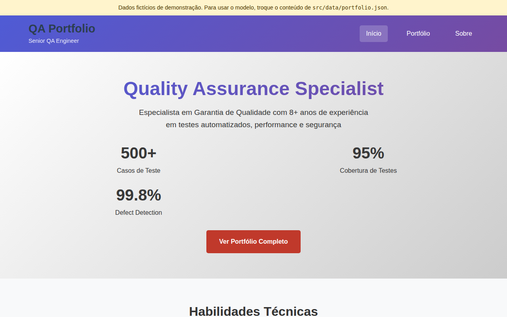
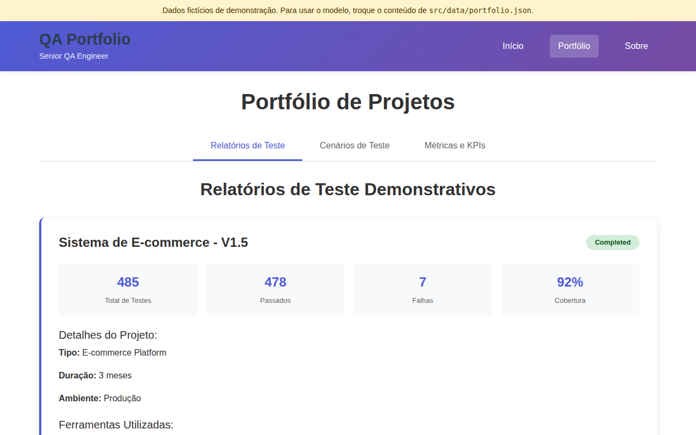
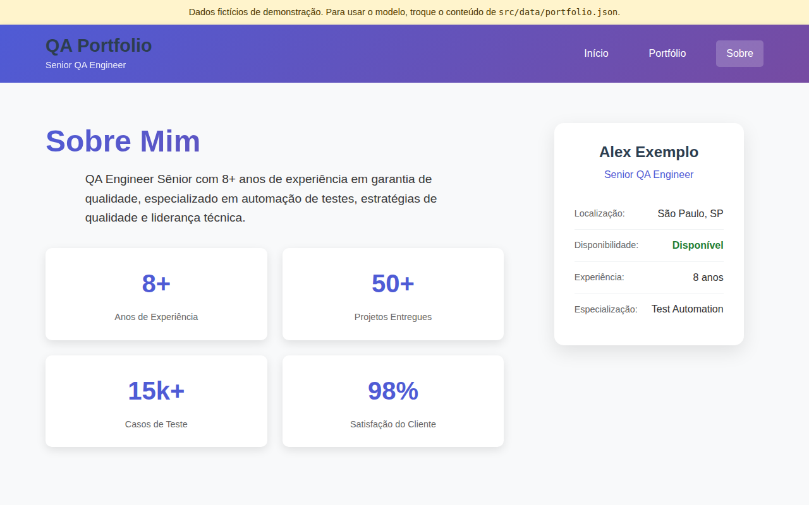

# QA Portfolio

Modelo de página de portfólio para profissionais de QA, em React. O site mostra perfil, habilidades, relatórios de teste, cenários, métricas de qualidade, experiência, certificações e ferramentas. **Todo o conteúdo vem de um único arquivo**, [`src/data/portfolio.json`](src/data/portfolio.json): para ter o seu portfólio, você troca esse arquivo e publica.

Os dados que vêm no repositório são **fictícios** ("Alex Exemplo"). Eles existem para mostrar o que cada seção oferece.



| Portfólio | Sobre |
|---|---|
|  |  |

## Use o modelo

1. Crie o seu repositório a partir deste ("Use this template" no GitHub, ou um fork).
2. Edite `src/data/portfolio.json` com os seus dados. Para remover o aviso de demonstração, troque `"demo": true` por `"demo": false`.
3. Rode `make ci`: a validação aponta qualquer campo ausente ou inválido pelo caminho (ex.: `home.skills[0].items: obrigatório`).
4. Publique (veja [Publicar](#publicar)).

### O arquivo de dados

| Chave | Onde aparece |
|---|---|
| `site` | Título e descrição da página; `demo` liga o aviso de dados fictícios |
| `profile` | Cabeçalho, página inicial e cartão de perfil em "Sobre" |
| `contacts` | Ícones do rodapé (URLs `https`; `icon` é um nome do [Boxicons](https://boxicons.com/), ex.: `bxl-github`) |
| `home` | Números e habilidades da página inicial |
| `about` | Resumo, números, filosofia, experiência, certificações e metodologias |
| `tools` | Stack tecnológica, agrupada por categoria |
| `reports`, `scenarios`, `metrics` | Abas da página "Portfólio" |

As regras completas estão em [`src/data/validate.js`](src/data/validate.js).

## Rodar

Requer Node.js 20.19 ou mais novo.

```bash
npm ci
npm run dev
```

O site abre em `http://localhost:5173`.

## Testar

| Comando | O que verifica |
|---|---|
| `make ci` | ESLint, testes unitários (Vitest e Testing Library) com cobertura mínima de 80% de linhas, validação do `portfolio.json` e build |
| `make e2e` | Navegação com Playwright e acessibilidade com axe (sem violações `serious` ou `critical`) sobre o build de produção |
| `make docs` | Lint do Markdown |

O CI roda tudo isso em cada pull request. Antes do primeiro `make e2e`, instale o navegador com `npx playwright install chromium`.

## Publicar

O projeto está pronto para a [Vercel](https://vercel.com/): importe o repositório e o `vercel.json` cuida do resto (build com Vite, saída em `dist/` e rotas diretas como `/about`). Em qualquer outro serviço de site estático, publique a pasta `dist/` gerada por `npm run build` e reescreva as rotas desconhecidas para `index.html`.

Uma versão nova é criada pelo workflow **Release tag** (Actions → Release tag → Run workflow), que cria a tag e a release com as notas geradas.

## Como o projeto é desenvolvido

O desenvolvimento segue Spec Driven Development com o [sdd-kit](https://github.com/fabiodrneles/sdd-kit): cada mudança tem uma spec em [`specs/`](specs/README.md), um ticket e um pull request com o CI verde. O [CHANGELOG](CHANGELOG.md) lista o que mudou em cada versão.
